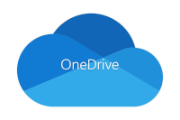

# Introduction

## Bienvenue!

Nous sommes heureux de vous accueillir.

  
  

## Parcours et contenu du programme

- 420.B0 Techniques de l'informatique — formation générale
- 420.B5 DEC + BAC en informatique
- Cours de technique : orientation Web et Programmation (HTML, CSS, JavaScript, Python, Ajax, Android, Services Web, C#, etc.)
- Bases de données, réseautique, etc.
- Cours complémentaires : 2 cours au choix pour les étudiants 420.B0
- Cours généraux : français, anglais, philosophie, éducation physique et communication
- Note : seuls les cours de math diffèrent entre les cheminements régulier et DEC+BAC

## Logigramme

Voir le logigramme des cours et des préalables.

## Réseau sans-fil

  - FXG-Secure : pour ordinateurs portables
    - Authentification : `cegep-fxg\\VotreNumeroDA`
    - Mot de passe : même que Omnivox
  - FXG-Invite : pour téléphones et tablettes (aucune authentification)
  - Voir un technicien au Centre de services (entrée du 1660) si nécessaire

  

## Omnivox

- https://cegepgarneau.omnivox.ca
- Application mobile : Omnivox Mobile (Google Play)
- Services : documents distribués, travaux (énoncés et remises), accès aux notes d'évaluation
- MIO : messagerie interne — dans les options, cochez « Avis par courriel » et indiquez votre courriel

## Département d'informatique

- Site : http://deptinfo.cegepgarneau.ca/
- Informations : horaires des professeurs, liste des cours et horaire maître, logigramme, stages, ATE, Garneau Travail
- Ressources : tutorat par les pairs, coffre à outils, ressources (CD, RP, API)

## Impression

- Crédits d'impression : environ 5$ (≈ 40 pages) par session
- Acheter des crédits à la Coop
- Imprimantes accessibles (ex.) : Imp-440, Imp-441
- Serveur d'impression : `\\dti-imp-etud.cegep-fxg.qc.ca`

  
  

## Gestion de fichiers

Conseils pour structurer et sauvegarder vos fichiers : Explorateur Windows, sauvegardes fréquentes.

- Stockage : espace personnel réseau, clé USB, disque dur externe, OneDrive, Google Drive, Dropbox, Git, etc.

  
  
  
  
  

## La vie au Département

- Local étudiant : G-4810
- Les professeurs sont disponibles (horaires de disponibilité affichés à la porte et sur Omnivox)

  

  

## Bonne session !

Bonne session et bienvenue au cours.

