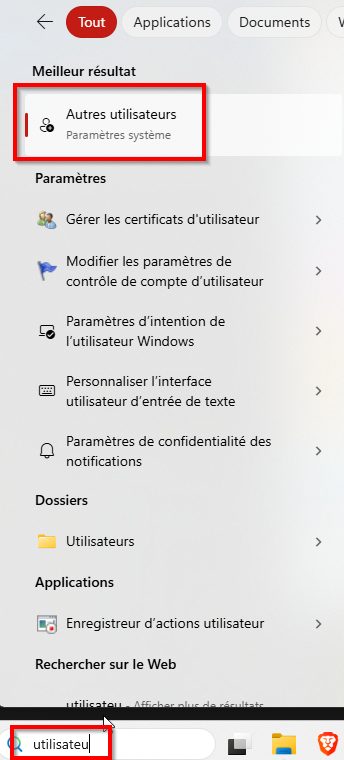
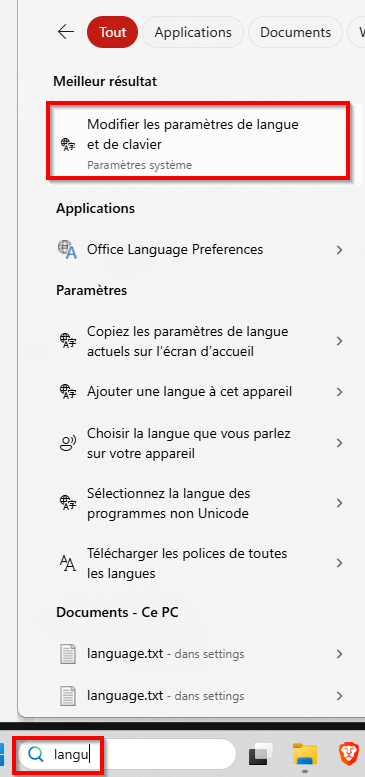
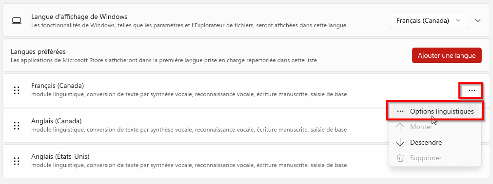
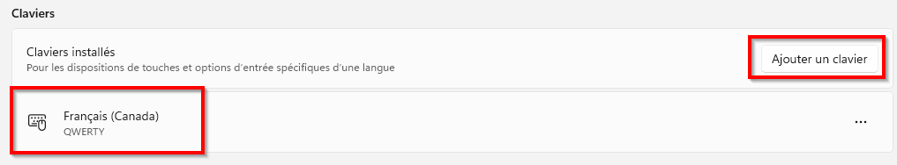
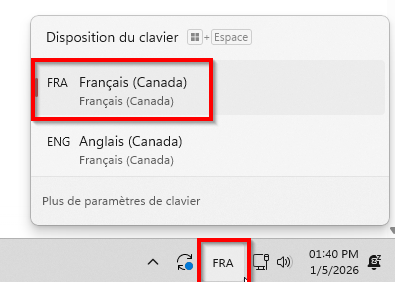
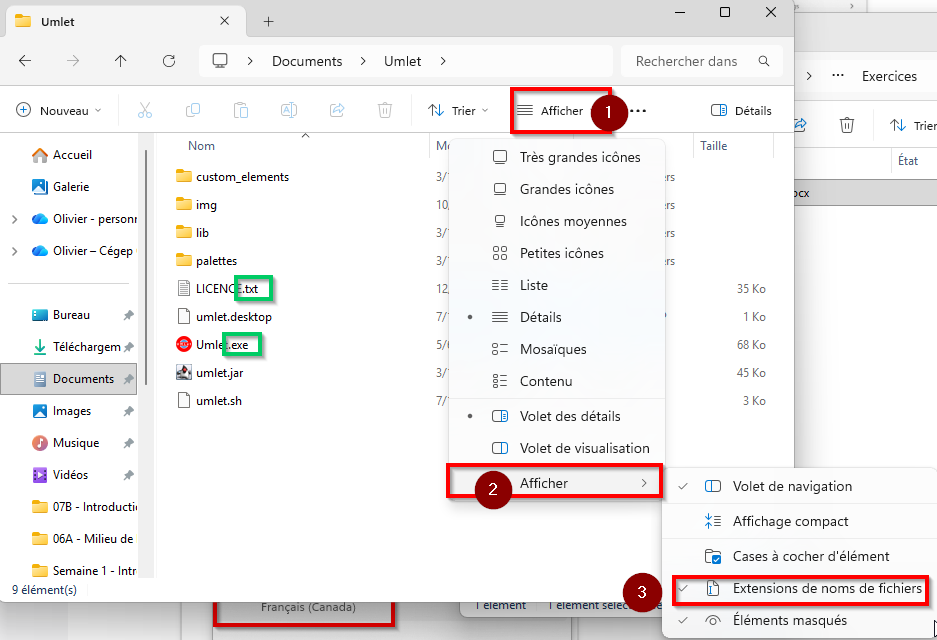
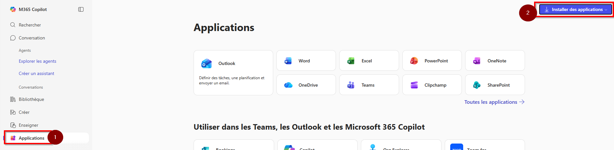
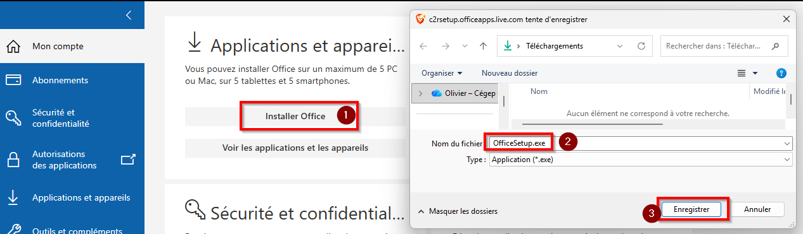
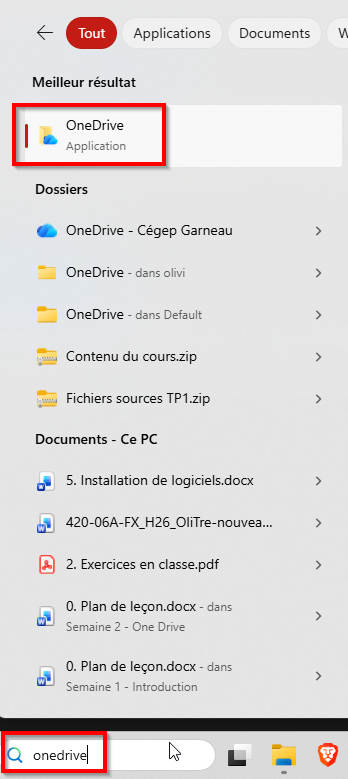
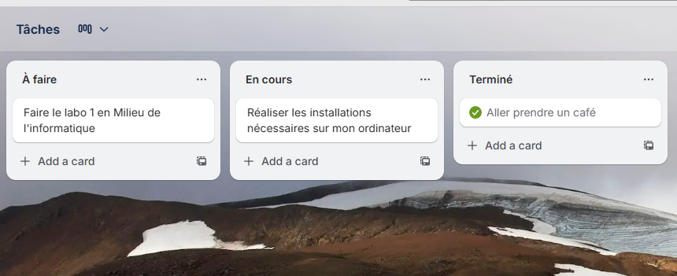

# Installations et configurations

:::tip Une configuration initiale correcte évite beaucoup de perte de temps (mauvaises langues de clavier, notifications manquantes, fichiers non synchronisés). Les outils installés (navigateur, suite M365, OneDrive, Outlook, Teams) seront essentiels pour votre programme d'études.
:::

:::warning Vous devez effectuer les configurations suivantes avant de réaliser le **[laboratoire 1](../../labs/01-vocabulaire)** qui est à remettre d'ici le prochain cours.
:::

## Installations requises

<ul class="checklist">
  <li><label><input type="checkbox">Créer votre session utilisateur sur l'ordinateur</label></li>
  <li><label><input type="checkbox">Vérifier et configurer la langue et la disposition du clavier (Français — Canada)</label></li>
  <li><label><input type="checkbox">Afficher les extensions de fichiers</label></li>
  <li><label><input type="checkbox">Installer Google Chrome et ajouter vos favoris</label></li>
  <li><label><input type="checkbox">Installer Teams, OneDrive et Outlook, activer notifications</label></li>
  <li><label><input type="checkbox">Configurer la synchronisation OneDrive</label></li>
  <li><label><input type="checkbox">Créer votre horaire dans Teams</label></li>
  <li><label><input type="checkbox">Installer les applications mobiles recommandées (Outlook, Teams, OneDrive, Omnivox)</label></li>
  <li><label><input type="checkbox">Créer un Trello pour une gestion pratique de vos tâches</label></li>
</ul>

## Créer votre session utilisateur sur l'ordinateur

- Ouvrir **Paramètres** → **Comptes** → **Autres utilisateurs**.
- Cliquer sur **Ajouter un compte**, puis suivre l'assistant pour ajouter un compte.
- Utilisez votre courriel .edu du Cégep ou un autre adresse courriel de votre choix.

## Vérifier et configurer la langue / disposition du clavier

- Ouvrir **Paramètres** → **Heure et langue** → **Langue et région**.
- Ajouter **Français (Canada)** si nécessaire et définir la disposition de clavier correspondante.
- Supprimer les langues inutiles et tester la saisie (icône langue dans la barre des tâches).

## Afficher les extensions de fichiers

- Dans **Explorateur de fichiers** : **Affichage** → activer **Extensions de nom de fichier** (ou dans **Options** → **Affichage**, décocher «Masquer les extensions des fichiers connus»).
- Vérifier que les fichiers affichent maintenant leur extension (ex. `fichier.docx`).

## Installer Google Chrome et gérer les favoris

- Télécharger Chrome : https://www.google.com/chrome et lancer l'installateur.
- Ouvrir Chrome, se connecter pour synchroniser les favoris entre appareils.
- [Définir Chrome comme navigateur par défaut](https://support.google.com/chrome/answer/95417?hl=fr&co=GENIE.Platform%3DDesktop#zippy=%2Cwindows).
- Activer la barre des favoris (Ctrl+Shift+B) et ajouter un dossier de favoris via l'étoile dans la barre d'adresse.

> [!NOTE]
> Vous pouvez également opter pour un autre navigateur tel que [Firefox](https://www.firefox.com/) ou [Brave (pas de compte ou synchronisation)](https://brave.com/).

## Installer Teams, OneDrive et Outlook

- Télécharger [Microsoft 365](https://office.com)
    - 
    - 
- Télécharger [Teams](https://apps.microsoft.com/detail/xp8bt8dw290mpq?hl=fr-CA&gl=CA)
- Télécharger [Outlook](https://apps.microsoft.com/detail/9nrx63209r7b?hl=fr-CA&gl=US)

- Se connecter aux applications avec votre compte Cégep .edu.
- Dans **Teams** : Paramètres → **Notifications** → activer les notifications souhaitées.
- Dans **Outlook** : vérifier que le calendrier est présent.

## Configurer OneDrive (synchronisation)

- Lancer OneDrive, se connecter et sélectionner les dossiers à synchroniser.
- Vérifier l'icône de synchronisation (en cours / coche verte) pour confirmer que tout se synchronise.

## Créer votre horaire dans Teams

- Ouvrir **Teams** → **Calendrier**
- Vous pouvez voir et ajouter des rencontres à votre calendrier.

## Installer les applications mobiles recommandées

- Sur mobile, ouvrir **App Store** ou **Google Play**, rechercher **Outlook**, **Teams**, **OneDrive**, **Omnivox** et installer.
- Se connecter et activer les notifications. (Optionnel : ajouter le widget Agenda sur l'écran d'accueil.)

## Créer un compte Trello

- Rendez-vous sur **https://trello.com/** et créez-vous un compte.
- Trello est un système de gestion de tâches léger.
- Il vous permet de créer des tableaux avec des listes personnalisables.
- Mon astuce personnelle pour la session: créer une liste distincte pour chaque semaine **(Semaine 1, Semaine 2, Semaine 3, etc.)** et cocher les tâches lorsque terminées.
- Bonus: plusieurs profs l'utilisent dans certains cours.

