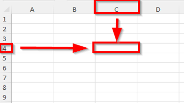
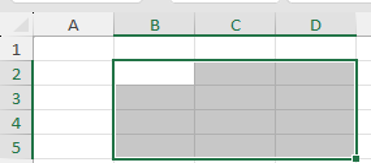
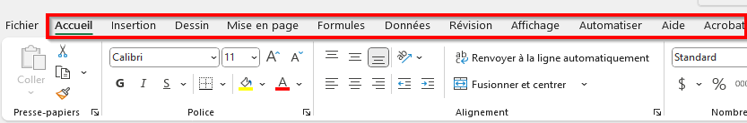

# Orientation Excel

## Exercice associé

<a href="./../../module-02/01-Orientation%20et%20mise%20en%20forme.xlsx" target="_blank" rel="noopener">01 – Orientation</a>

## Cellules
Une **cellule** est l’unité de base d’Excel.  
Elle est identifiée par une lettre (colonne) et un chiffre (ligne), par exemple `A1`.

- Une cellule contient une seule information
- Elle peut contenir un texte, un nombre ou une formule

## Plages
Une **plage** est un ensemble de cellules.

- Exemple : `A1:A10`
- Les plages sont utilisées dans les formules et fonctions
- Elles facilitent l’analyse et les calculs
  

## Feuilles
Un **classeur** peut contenir plusieurs **feuilles**.

- Chaque feuille peut représenter un thème ou une étape
- Les feuilles peuvent être renommées
- Une formule peut référer à une autre feuille

## Bandeau (ruban)
Le **bandeau** regroupe les commandes d’Excel par onglets.

- Accueil : saisie et mise en forme
- Insertion : tableaux et graphiques
- Formules : fonctions
- Mise en page : impression

