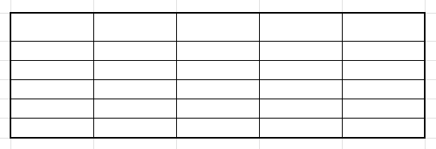
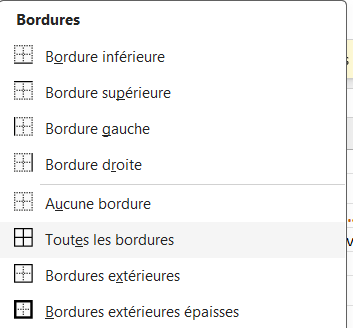
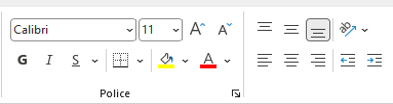
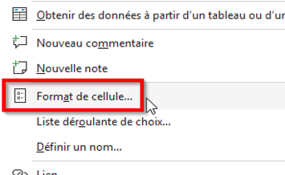
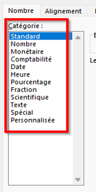
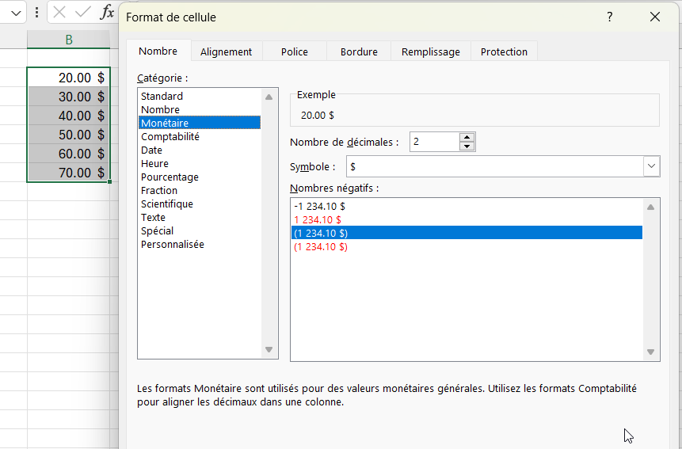

# Mise en forme

## Exercice associé

[02 – Mise en forme](https://livecegepfxgqc-my.sharepoint.com/:x:/g/personal/otremblay_cegepgarneau_ca/IQD_fIO7yqPoTL2j7lADpvtxAZuDsA2uUfGBWq6x2GiTMxM?e=9m87uk)

⚠️ Ne travaillez pas dans la version Excel du navigateur Web.

**Veuillez télécharger une copie de chaque exercice.**
- Fichier --> Créer une copie --> Télécharger une copie

## Bordures
Les **bordures** servent à structurer visuellement un tableau.

- Délimitent les cellules
- Améliorent la lisibilité
- À utiliser de façon cohérente

- Il faut parfois jouer avec l'ordre d'application des bordures pour obtenir le résultat voulu (ex.: toutes les bordures d'abord et ensuite mettre les bordures extérieures épaisses).
  

## Police et alignement
- Police : taille, gras, couleur

- Alignement horizontal et vertical
- La changer la direction du texte 
- Fusion de cellules (avec modération)

## Types de données
Excel interprète automatiquement les données saisies.

- Texte
- Nombre
- Date
- Pourcentage
- Monétaire

⚠️ Parfois il faut changer le format manuellement (ex.: comptabilité vs monétaire).

