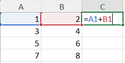
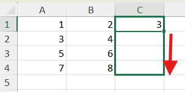
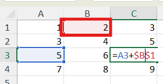
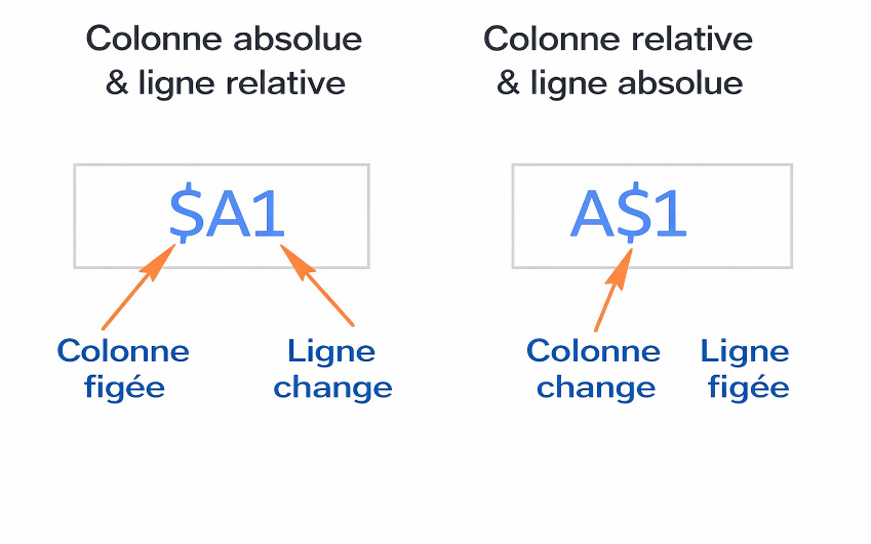

# Formules de base

## Exercice associé

[03 – Formules de base](https://livecegepfxgqc-my.sharepoint.com/:x:/g/personal/otremblay_cegepgarneau_ca/IQC3p9bnI29pQ4HA48_rY2DpAYJBWxDKEtJeuDLRCHHfNfc?e=ETCGdi)

⚠️ Ne travaillez pas dans la version Excel du navigateur Web.

**Veuillez télécharger une copie de chaque exercice.**
- Fichier --> Créer une copie --> Télécharger une copie

## Calculs arithmétiques
Une formule commence toujours par `=`.

Opérations possibles :
- Addition `+`
- Soustraction `-`
- Multiplication `*`
- Division `/`

Exemple :

```txt
=A1+B1
```



## Étendre des calculs / formules

- En tirant le coin d'une cellule, on peut étendre une formule automatiquement



## Références relatives
Par défaut, Excel utilise des **références relatives**.

- Elles s’ajustent lors de la copie
- Exemple : `A1` devient `A2`

## Références absolues
Une **référence absolue** ne change pas.

- Utilise le symbole `$`
- Exemple : `$A$1`
- Utile pour des valeurs fixes (taxes, taux)



- Le $ avant la lettre fige la colonne (A, B, C, etc.) et le $ avant le nombre fige la ligne (1, 2, 3, etc.)



