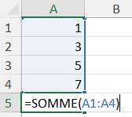
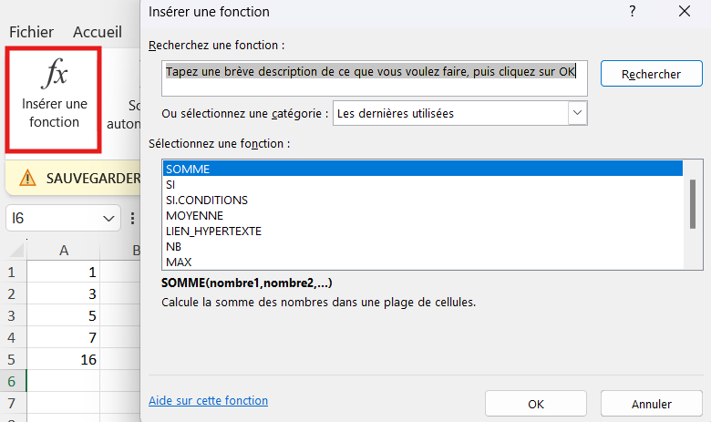

# Fonctions mathématiques

## Exercice associé

<a href="./../../module-02/04-Fonctions%20math%C3%A9matiques.xlsx" target="_blank" rel="noopener">04 – Fonctions mathématiques</a>

## Syntaxe et séparateur
Une fonction suit la structure :

```txt
NOM_FONCTION(argument1; argument2; etc.)
```

⚠️ Le séparateur dépend du système :
- `;` sur la plupart des systèmes francophones
- `,` sur certains systèmes anglophones

## Fonctions courantes
- SOMME : additionne des valeurs
- MOYENNE : calcule une moyenne
- MAX : valeur la plus élevée
- MIN : valeur la plus basse
- NB : compte les cellules numériques
- NBVAL : compte les cellules non vides
- NB.VIDE : compte les cellules vides
- ENT : Conserve la partie entière d'un nombre (ex: 31.6 --> 31)
- Arrondi : Arrondi un nombre au nombre entier le plus près (ex: 31.6 --> 32)

## Exemples (pour des plages de valeurs)
- =SOMME(A1:A10)
- =MOYENNE(B1:B5)
- =MAX(C1:C20)
  


## Insertion d'une fonction

Dans l'onglet `Formules` il y a un bouton `Insérer une fonction`. Cette option permet d'insérer une fonction en utilisant un assistant graphique.



