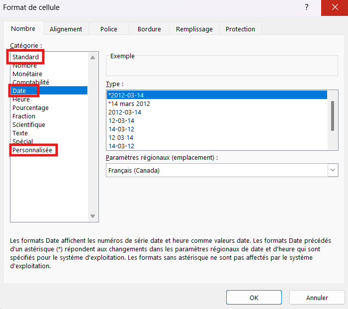
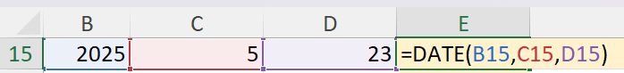
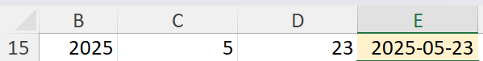
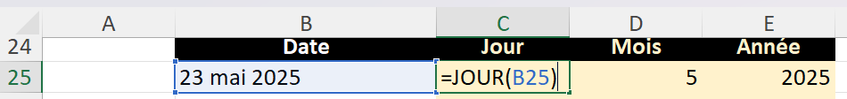
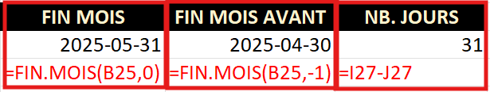
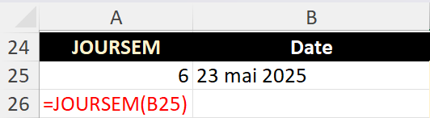

# Fonctions de date

## Exercice associé

[05 – Fonctions de date](https://livecegepfxgqc-my.sharepoint.com/:x:/g/personal/otremblay_cegepgarneau_ca/IQD5biM3pyoiTKh1B1NGwKH9Afx4LnP_KL1jcuqNDMieI58?e=V23UDD)

⚠️ Ne travaillez pas dans la version Excel du navigateur Web.

**Veuillez télécharger une copie de chaque exercice.**
- Fichier --> Créer une copie --> Télécharger une copie

## Dates dans Excel
Les dates sont des constantes numériques. On additionne 1 à tous les jours depuis le 1er janvier 1900.

ex.: `23 mai 2025` (format date longue) = `45800` (format standard = nombre de jours depuis 1er janvier 1900)

## Format de cellule des dates

- **Standard** : Affiche la date en tant que nombre de jours depuis 1er janvier 1900
- **Date** : format recommandé. Affiche correctement une valeur de date selon les paramètres régionaux.
- **Personnalisé** : permet de contrôler précisément l’affichage (ex. `aaaa-mm-jj`, `jj/mm/aaaa`).



## Fonction AUJOURDHUI()
Retourne dynamiquement la date courrante.

## Fonction DATE
Crée une date à partir de valeurs numériques.

```txt
=DATE(annee; mois; jour)
```





## Fonctions JOUR, MOIS et ANNEE
Extraient une partie d'une date.

- JOUR(A1)
- MOIS(A1)
- ANNEE(A1)



## Fonction FIN.MOIS
Retourne le dernier jour d'un mois.

- FIN.MOIS(A1; 0) : fin du mois courant
- FIN.MOIS(A1; 1) : fin du mois suivant
- FIN.MOIS(A1; -1) : fin du mois précédent

>Dans l'exemple ci-bas, mois_courrant - mois_précédent nous retourne le nombre de jours dans le mois courrant. (B25 = 23 mai 2025)



## Fonction JOURSEM(date)
Retourne le jour de la semaine en format numérique (1=Dimanche, 7=Samedi)


