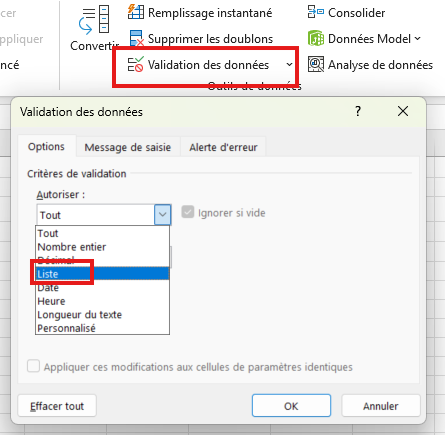
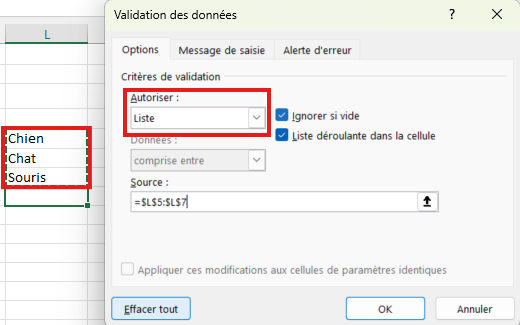
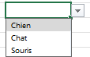
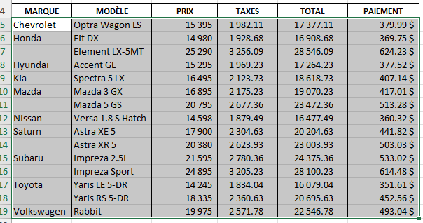
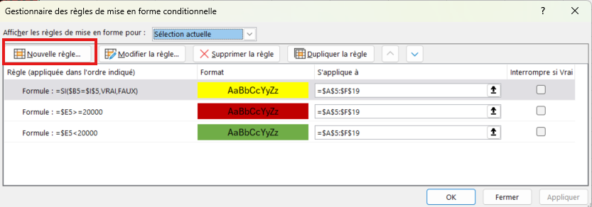
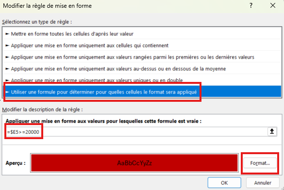
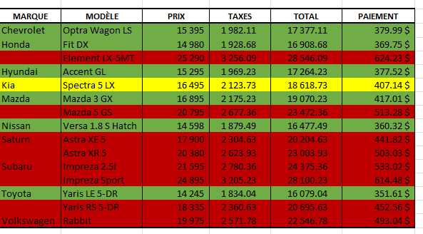

# Mise en forme conditionnelle

## Exercice associé

[07 – Mise en forme conditionnelle et validation des données](https://livecegepfxgqc-my.sharepoint.com/:x:/g/personal/otremblay_cegepgarneau_ca/IQD2hGLn0VRtRqPzcce-dbgrAfT0j_iYCVzTVzHl8mvgX_s?e=u2PK9n)

⚠️ Ne travaillez pas dans la version Excel du navigateur Web.

**Veuillez télécharger une copie de chaque exercice.**
- Fichier --> Créer une copie --> Télécharger une copie

## Objectif
- Appliquer une mise en forme automatique selon des conditions
- Mettre en évidence rapidement les données importantes
- Visualiser les tendances et comparaisons dans les données
- Contrôler la saisie de données avec la validation
- Limiter les erreurs en utilisant des listes déroulantes et des règles de validation

## Validation des données
Limite les valeurs que l'utilisateur peut entrer. Évite les erreurs de saisie.

**Types de validation :**
- **Listes déroulantes** : l'utilisateur choisit parmi des valeurs prédéfinies
- **Plages numériques** : accepte seulement les nombres dans une certaine plage (ex. : entre 0 et 100)
- **Messages d'erreur** : affiche un message personnalisé si la saisie est invalide

### Exemple : créer une liste déroulante
**Objectif :** permettre à l'utilisateur de choisir une catégorie (Fruits, Légumes, Viandes)

1. Sélectionner les cellules où la liste déroulante doit apparaître

2. Aller à **Données** > **Validation des données**

3. Dans l'onglet **Paramètres**, choisir **Liste** comme critère de validation

4. Entrer les valeurs séparées par des points-virgules : `Fruits;Légumes;Viandes` OU Sélectionner une plage avec votre souris.

5. Cocher **Liste déroulante** pour afficher la flèche

6. Valider

> Les utilisateurs peuvent maintenant cliquer sur la flèche pour sélectionner une valeur, ou taper directement la valeur si elle existe dans la liste.

## Mise en forme conditionnelle
La mise en forme conditionnelle applique automatiquement des styles (couleurs, barres, icônes) selon le contenu des cellules.

**Types de règles disponibles :**
- **Surbrillance** : colore les cellules selon une condition simple (égal, supérieur, contient un texte, etc.)
- **Valeurs de plage haute ou basse** : identifie les n meilleures ou n pires valeurs
- **Barre de données** : affiche une barre proportionnelle à la valeur (visualisation rapide)
- **Nuance de couleurs** : crée un dégradé de couleurs selon la valeur (vert/jaune/rouge, par exemple)
- **Jeux d'icônes** : affiche des icônes (flèches, feux, étoiles) selon le seuil

### Procédure
1. Sélectionner la plage de données à formater
2. Aller à **Accueil** > **Mise en forme conditionnelle**
3. Choisir le type de règle :
   - sélectionner une option prédéfinie OU
   - **Nouvelle règle** : créer une règle personnalisée (approche recommandée)
4. Définir les paramètres (condition, valeur seuil, format)
5. Appliquer et observer le résultat

### Exemple de format personnalisé
**Exemple – Mettre en rouge si le prix est plus élevé que 20k$ :**
1. Sélectionner toutes les cellules qui pourraient être impactées par la mise en forme (toutes les données du tableau)

2. Aller à **Accueil** > **Mise en forme conditionnelle** > **Gérer les règles**

3. Cliquer sur **Nouvelle règle**

4. Choisir la dernière option : **Utiliser une formule pour déterminer les cellules à formater**

5. Entrer la formule (on veut vérifier à partir de E5, et seulement la colonne E, donc $ avant la colonne) :
   - `=$E5>=20000`
6. Définir le format (couleur rouge) et appliquer

>La procédure est similaire pour la couleur verte.

