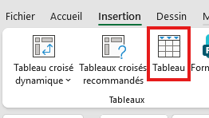
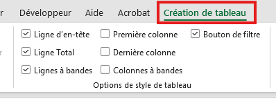
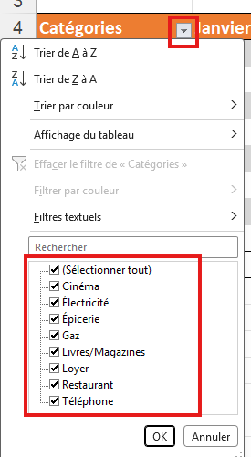
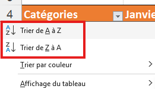

# Tableaux, filtres et tris

## Exercice associé

[09 – Tableaux, filtres et tris](https://livecegepfxgqc-my.sharepoint.com/:x:/g/personal/otremblay_cegepgarneau_ca/IQBebLKkJll2Q4TKamFEqUkPAcKrPaghhxrRiaXQM2UPkuc?e=b54kdp)

⚠️ Ne travaillez pas dans la version Excel du navigateur Web.

**Veuillez télécharger une copie de chaque exercice.**
- Fichier --> Créer une copie --> Télécharger une copie

## Objectif
- Transformer une plage en **tableau Excel**.
- Afficher une **ligne de total** sans écrire de formule compliquée.
- Utiliser les **filtres** et **tris** des en-têtes.

## Création de tableaux
Transformer une plage en tableau Excel.

### Où est le bouton « Tableau » ?
- Onglet **Insertion** du ruban.
- Groupe **Tableaux**.
- Bouton **Tableau** (icône avec un petit quadrillage).

### Procédure
1. **Sélectionner toute la plage de données (y compris la ligne d’en-tête).**
2. Aller dans **Insertion > Tableau**.
3. Vérifier que la plage proposée est correcte.
4. Cocher **Mon tableau comporte des en-têtes**.
5. Valider avec **OK**.

Résultat :
- Les en-têtes ont des **petites flèches** de filtre.
- Le tableau a un style automatique (bandes de couleur).

## Ligne de total
La ligne de total permet de calculer des sommes sans écrire la fonction **SOMME**.
On peut également étendre la formule qui est générée.

### Où activer la ligne de total ?
- Cliquer n’importe où **dans le tableau**.
- Un nouvel onglet apparaît dans le ruban : **Création de tableau** ou **Outils de tableau > Création** (selon la version).
- Dans le groupe **Options de style de tableau** : case à cocher **Ligne des totaux**.

### Procédure
1. Cliquer dans le tableau.
2. Aller dans **Outils de tableau > Création**.
3. Cocher **Ligne des totaux**.
4. Dans la dernière ligne qui apparaît, cliquer dans une cellule de la colonne à totaliser.
5. Ouvrir la petite **liste déroulante** qui apparaît dans la cellule (triangle) et choisir **Somme**.

## Filtres
Les filtres servent à **afficher seulement certaines lignes**.

### Où sont les boutons de filtre ?
- Dans chaque **cellule d’en-tête** du tableau.
- Ce sont les **petites flèches** à droite du nom de colonne.

### Procédure de base
1. Cliquer sur la flèche dans l’en-tête de la colonne voulue.
2. Choisir **Filtres de texte** ou **Filtres de nombre** si nécessaire.
3. Cocher/décocher les valeurs à afficher.
4. Valider avec **OK**.

## Tri
Le tri sert à **classer les lignes** (du plus petit au plus grand, ou inversement).

### Où sont les boutons de tri ?
- Dans la flèche de filtre de la colonne.
	- Options **Trier du plus petit au plus grand** / **Trier du plus grand au plus petit**.
- Ou dans l’onglet **Données** du ruban.
	- Groupe **Trier et filtrer**.
	- Boutons **A→Z**, **Z→A** ou **Trier…**.

### Procédure (exemple : trier sur une colonne de mois)
1. Cliquer dans **une cellule de la colonne à trier** (par exemple la colonne des mois).
2. Ouvrir la **flèche de filtre** de cette colonne.
3. Choisir **Trier du plus petit au plus grand** (ou l’option demandée dans l’exercice).

