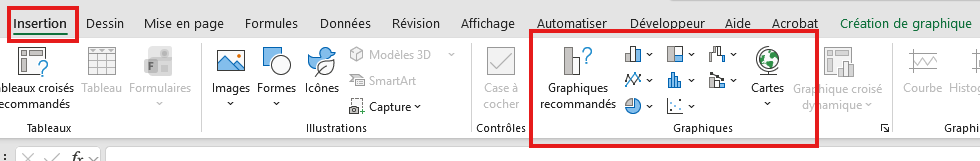
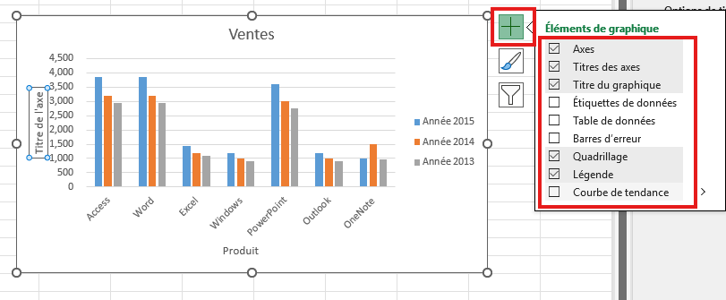
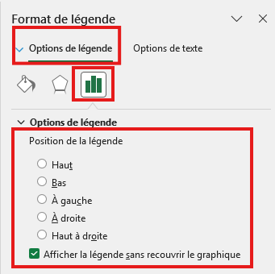

# Graphiques

## Exercice associé

[10 – Graphiques](https://livecegepfxgqc-my.sharepoint.com/:x:/g/personal/otremblay_cegepgarneau_ca/IQDEFk8w9hsjQq_4KU2HBDmSAWaii9EZpUfgVpk-VAt2-10?e=ccHQ8S)

⚠️ Ne travaillez pas dans la version Excel du navigateur Web.

**Veuillez télécharger une copie de chaque exercice.**
- Fichier --> Créer une copie --> Télécharger une copie

## Objectif
- Créer des graphiques pour visualiser les données
- Choisir le type de graphique approprié selon le contexte
- Personnaliser l'apparence des graphiques
- Modifier et mettre à jour les données d'un graphique

## Choix du graphique
Chaque type de graphique a un usage précis selon les données à représenter.

**Types de graphiques courants :**
- **Histogramme (colonnes)** : comparer des valeurs entre différentes catégories
- **Graphique en courbes** : montrer l'évolution dans le temps ou les tendances
- **Graphique en secteurs (camembert)** : afficher les proportions d'un ensemble (total = 100%)
- **Graphique à barres** : similaire à l'histogramme, mais horizontal
- **Nuage de points** : montrer la relation entre deux variables numériques

## Insérer un graphique

### Où est le bouton « Graphiques » ?
- Onglet **Insertion** du ruban
- Groupe **Graphiques**
- Choisir le type de graphique souhaité

### Procédure
1. **Sélectionner les données** incluant les en-têtes (titres de colonnes)
2. Aller dans **Insertion** > **Graphiques**
3. Choisir le type de graphique approprié
   - Pour comparer : **Histogramme**
   - Pour l'évolution : **Courbes**
   - Pour les proportions : **Secteurs**
4. Le graphique s'insère automatiquement dans la feuille

::: tip Conseil
Assurez-vous que vos données sont bien organisées en colonnes avec des en-têtes clairs avant de créer le graphique.
:::

## Édition et personnalisation

### Modifier le titre du graphique
1. Cliquer sur le **titre du graphique**
2. Taper le nouveau titre directement

### Ajouter ou modifier les titres des axes
1. Cliquer sur le graphique
2. Aller dans **Création de graphique** (onglet contextuel)
3. Cliquer sur **Ajouter un élément de graphique** > **Titres des axes**
4. Choisir **Axe horizontal principal** ou **Axe vertical principal**
5. Modifier le texte du titre

### Modifier les couleurs et le style
1. Cliquer sur le graphique
2. Utiliser les boutons rapides à droite du graphique :
   - **Styles du graphique** (pinceau) : changer les couleurs et le style
   - **Éléments de graphique** (+) : ajouter/retirer des éléments (légende, quadrillage, etc.)
   - **Filtres de graphique** (entonnoir) : afficher/masquer des séries de données

### Modifier la légende
1. Cliquer sur la légende
2. La déplacer en la faisant glisser
3. Utiliser les options à droite pour la positionner (en haut, à droite, etc.)

