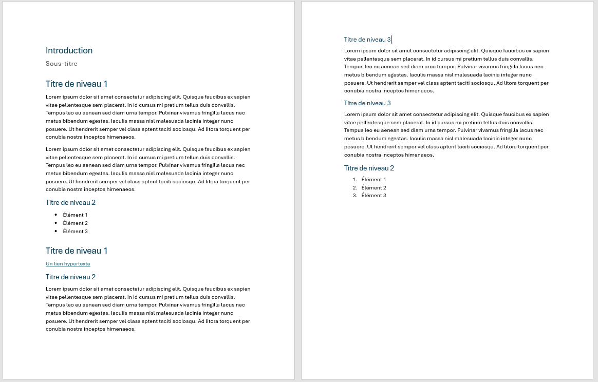

# Structure et styles

## Exercice associé

Téléchargez et ouvrez le document de départ fourni et modifiez le texte encadré en appliquant les bons styles de titres.

**Exercice de départ à télécharger : <a href="../../public/module-03/Exercice_Word_Depart.docx" target="_blank" rel="noopener">Exercice_Word_Depart.docx</a>**

À faire dans cette étape :

- appliquer les styles Titre 1, Titre 2 et Titre 3 aux bons endroits;
- laisser le texte courant en style normal;
- créer les listes demandées;
- ajouter le lien hypertexte prévu;
- vérifier le résultat dans le volet de navigation.

Utilisez du [texte lorem](https://loremipsum.io/) pour générer le texte.

<figure>
	
	<figcaption>Exemple de résultat attendu pour l'exercice</figcaption>
</figure>

## Ressources pour vous aider

### Ajouter un titre

Permet d'appliquer correctement les niveaux de titres dans Word. C'est essentiel parce que toute la structure du document et la future table des matières en dépendent.

Lien : [Microsoft Support](https://support.microsoft.com/fr-fr/office/ajouter-un-titre-3eb8b917-56dc-4a17-891a-a026b2c790f2)

### Créer une liste à puces ou une liste numérotée

Montre comment structurer une information sous forme de liste. C'est pratique si vous devez présenter des éléments de manière claire dans certaines sections d'un rapport.

Lien : [Microsoft Support](https://support.microsoft.com/fr-fr/office/cr%C3%A9er-une-liste-%C3%A0-puces-ou-une-liste-num%C3%A9rot%C3%A9e-9ff81241-58a8-4d88-8d8c-acab3006a23e)

### Créer ou modifier un lien hypertexte

Permet d'insérer des liens cliquables dans le document. Cela sert notamment à rendre les sources d'images accessibles directement depuis une légende.

Lien : [Microsoft Support](https://support.microsoft.com/fr-fr/office/cr%C3%A9er-ou-modifier-un-lien-hypertexte-5d8c0804-f998-4143-86b1-1199735e07bf#:~:text=Appuyez%20sur%20Ctrl%2BK.,lien%20dans%20la%20zone%20Adresse.)