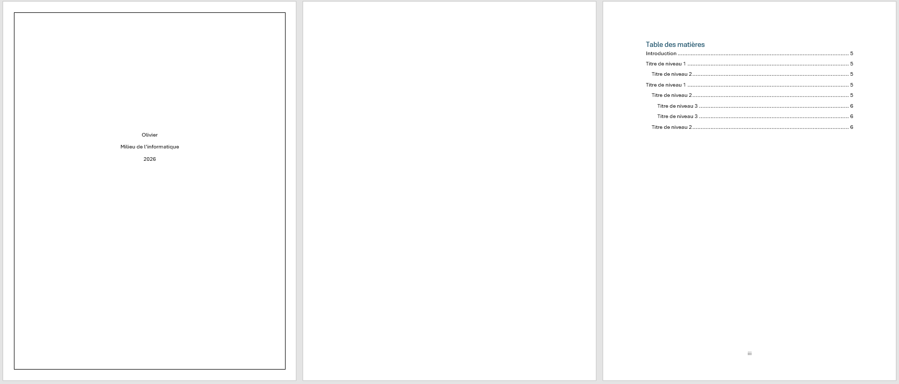
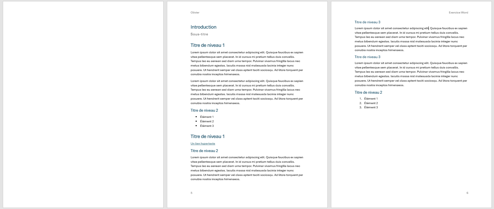

# Mise en page et repères du document

## Exercice associé

Reprenez le document commencé à l'étape précédente et transformez-le en document plus structuré et plus professionnel.

À faire dans cette étape :

- créer une page de présentation simple au début du document (avant le premier titre);
    - Elle doit inclure une bordure appliquée uniquement à la première page
    - Écrire 3 lignes de texte et les centrer horizontalement (ex.: votre nom, le cours et l'année).
- insérer ensuite un **saut de section** pour ajouter une page blanche;
- ajouter une page réservée à la table des matières;
    - Insérer la table des matières sur sa propre page;
- ajouter un autre **saut de section** entre la table des matières et le contenu;
- ajuster les marges de la page de table des matières pour qu'elles soient larges;
- configurer un en-tête et un pied de page sur les pages de contenu seulement;
    - l'entête doit apparaître à gauche (votre nom) sur les pages impaires et à droite (Exercice) sur les pages paires;
- insérer des numéros de page;
    - Ils doivent apparaître à gauche pour les pages impaires et à droite pour les pages paires;

<figure>
    
    <figcaption>Exemple de page de présentation</figcaption>
</figure>

<figure>
    
    <figcaption>Exemple de pagination et d'en-têtes/pieds de page</figcaption>
</figure>

## Ressources pour vous aider

### Créer des sections différentes dans un document

Permet de créer de vraies séparations entre les pages. C'est important pour éviter les documents instables construits avec des Entrées répétées. De plus, cela facilite la mise en page distincte entre une page de présentation, une table des matières, et le reste du contenu. 

Lien très pratique : [Université de Limoges](https://www.unilim.fr/scd/formation/word-creer-des-sections-differentes-dans-un-document/)

Lien : [Microsoft Support](https://support.microsoft.com/fr-fr/office/ins%C3%A9rer-un-saut-de-section-eef20fd8-e38c-4ba6-a027-e503bdf8375c)

### Ajouter une bordure à une page

Permet d'ajouter une bordure visuelle autour d'une page. C'est utile pour une page de présentation.

Lien : [Microsoft Support](https://support.microsoft.com/fr-fr/office/ajouter-une-bordure-%C3%A0-une-page-82c2078a-af86-4f5a-ae2a-517164ba5801?ns=winword&version=90&ui=fr-fr&rs=fr-fr&ad=fr)

### Modifier les marges dans votre document Word

Explique comment ajuster l'espace en bordure de page. C'est utile notamment pour la page de table des matières, qui doit avoir une présentation différente.

Lien : [Microsoft Support](https://support.microsoft.com/fr-fr/office/modifier-les-marges-dans-votre-document-word-c95c1ea1-70b1-4dde-a1da-f5aa2042c829#:~:text=une%20marge%20personnalis%C3%A9e-,S%C3%A9lectionnez%20Disposition%20%3E%20Marges.,OK%20lorsque%20vous%20avez%20termin%C3%A9.)

### Insérer un en-tête ou un pied de page

Explique comment configurer les zones répétées en haut et en bas du document.

Lien : [Microsoft Support](https://support.microsoft.com/fr-fr/office/ins%C3%A9rer-un-en-t%C3%AAte-ou-un-pied-de-page-d832a10c-ef2e-4cff-988a-02bd582db12f)

### Insérer ou supprimer des numéros de page

Permet d'ajouter une pagination.

Lien : [Microsoft Support](https://support.microsoft.com/fr-fr/office/ins%C3%A9rer-ou-supprimer-des-num%C3%A9ros-de-page-f50e232f-5873-47a3-9d29-61bea3949c11)

### Créer différents en-têtes ou pieds de page pour les pages paires et impaires

Montre comment varier l'information selon la parité des pages. C'est essentiel pour reproduire fidèlement le modèle demandé.
Portez également attention au **bouton suivant**: `Lier au précédent` si vous commencez une nouvelle section

Lien : [Microsoft Support](https://support.microsoft.com/fr-fr/office/cr%C3%A9er-diff%C3%A9rents-en-t%C3%AAtes-ou-pieds-de-page-pour-les-pages-paires-et-impaires-c1b99d1a-38b1-40ff-8338-4897b89be2ef#:~:text=S%C3%A9lectionnez%20Insertion%20%3E%20En%2Dt%C3%AAte%20et,appara%C3%AEtre%20sur%20les%20pages%20paires.)

### Ajouter des numéros de page ou des formats de numéros différents sur différentes sections

Permet de combiner plusieurs systèmes de pagination dans un même document. C'est utile pour passer des chiffres romains aux chiffres arabes au bon endroit.

Lien : [Microsoft Support](https://support.microsoft.com/fr-fr/office/ajouter-des-num%C3%A9ros-de-page-ou-des-formats-de-num%C3%A9ros-diff%C3%A9rents-sur-diff%C3%A9rentes-sections-bb4da2bd-1597-4b0c-9e91-620615ed8c05)

### Insérer une table des matières

Montre comment générer et mettre à jour automatiquement la table des matières. À faire une fois les titres correctement appliqués dans l'exercice précédent.

Lien : [Microsoft Support](https://support.microsoft.com/fr-fr/office/ins%C3%A9rer-une-table-des-mati%C3%A8res-882e8564-0edb-435e-84b5-1d8552ccf0c0)

