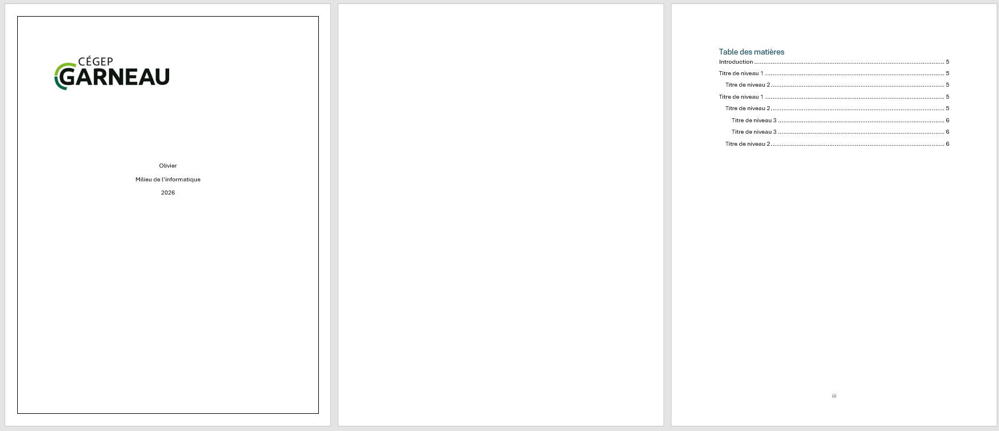
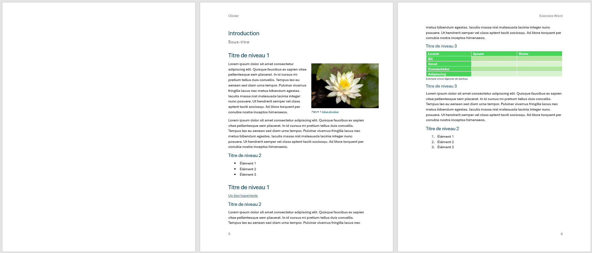

# Tableaux, images et légendes

## Exercice associé

Reprenez le même document et enrichissez-le avec des éléments visuels utiles, comme si vous prépariez une version plus crédible à montrer à quelqu'un.

À faire dans cette étape :

En dessous d'un titre de niveau 3: 
- Retirer le texte Lorem et :
- ajouter un tableau de 3 colonnes et 5 lignes;
- choisir un style de tableau autre que le style par défaut;
- donner un titre clair au tableau avec une **légende**;
- insérer 2 images liées au sujet choisi;
- utiliser un habillage du texte autour des images;
- ajouter une légende significative sous une des images;
- transformer la source de chaque image en lien cliquable dans la légende.

Images rapides à télécharger pour l'exercice :

- [Image 1](./images/image-1.jpg) https://stocksnap.io/photo/lotus-flower-VC8IOCGVII
- [Image 2](./images/image-2.jpg)

<figure>
	
	<figcaption>Exemple de tableau et de légende</figcaption>
</figure>

<figure>
	
	<figcaption>Exemple d'image avec habillage du texte et légende</figcaption>
</figure>

## Ressources pour vous aider

### Habiller une image avec du texte dans Word

Explique comment positionner une image par rapport au texte. C'est utile pour obtenir une mise en page plus propre que l'insertion brute d'une image au milieu du document. Ça évite le fameux cas où vous brisez votre document Word après avoir inséré une image.

Lien : [Microsoft Support](https://support.microsoft.com/fr-fr/office/habiller-une-image-avec-du-texte-dans-word-bdbbe1fe-c089-4b5c-b85c-43997da64a12)

### Ajouter, mettre en forme ou supprimer des légendes dans Word

Montre comment nommer correctement une image ou un tableau. C'est important parce qu'une légende claire améliore la compréhension et le professionnalisme du rapport. De plus, une fois la légende ajoutée on peut modifier le texte en ajouter un hyperlien vers la source de l'image/information.

Lien : [Microsoft Support](https://support.microsoft.com/fr-fr/office/ajouter-mettre-en-forme-ou-supprimer-des-l%C3%A9gendes-dans-word-82fa82a4-f0f3-438f-a422-34bb5cef9c81)

### Insérer un tableau

Explique comment créer la structure d'un tableau dans Word. C'est la base pour reproduire le tableau exigé dans le modèle.

Lien : [Microsoft Support](https://support.microsoft.com/fr-fr/office/ins%C3%A9rer-un-tableau-a138f745-73ef-4879-b99a-2f3d38be612a#:~:text=Pour%20un%20tableau%20de%20base,%3E%20Tableau%20%3E%20Ins%C3%A9rer%20un%20tableau.)

### Créer ou modifier un lien hypertexte

Permet d'ajouter un lien cliquable à du texte. C'est utile pour transformer la source d'une image en lien accessible directement dans la légende.

Lien : [Microsoft Support](https://support.microsoft.com/fr-fr/office/cr%C3%A9er-ou-modifier-un-lien-hypertexte-5d8c0804-f998-4143-86b1-1199735e07bf#:~:text=Appuyez%20sur%20Ctrl%2BK.,lien%20dans%20la%20zone%20Adresse.)

