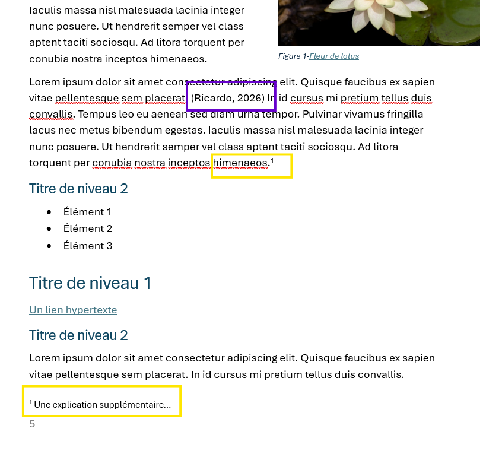
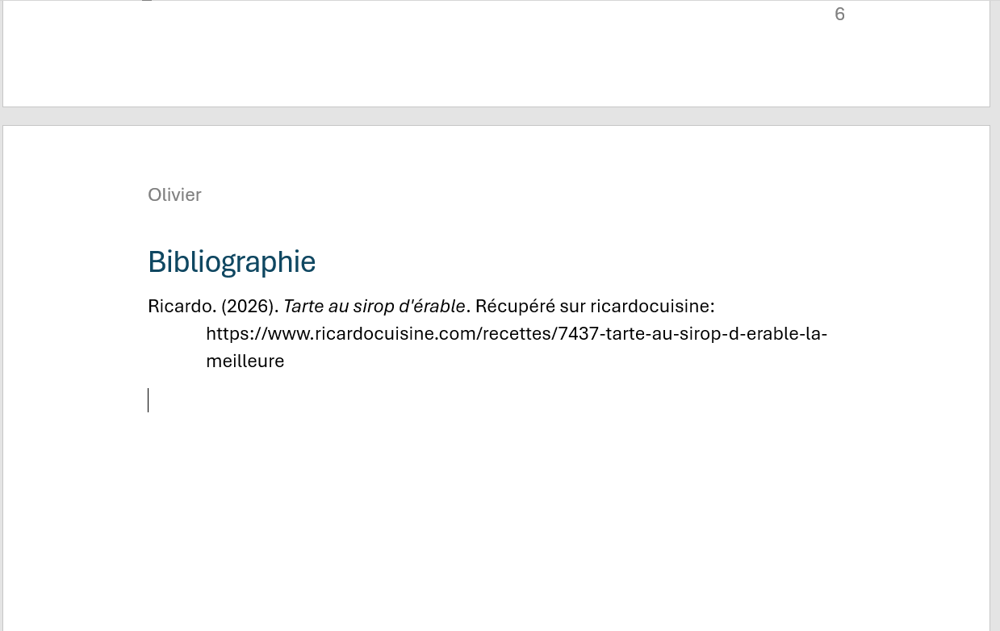
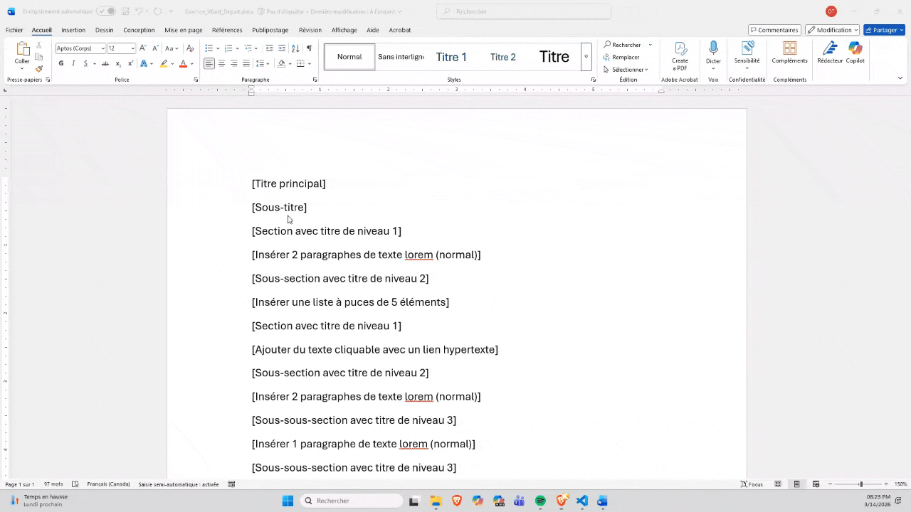

# Citations, révision et remise

## Exercice associé

Terminez le même document en lui ajoutant les éléments de finition qui le rapprochent d'un vrai travail remis.

À faire dans cette étape :

- insérer au moins une citation en format APA liée à une information de votre document (voir le carré violet sur l'image);
- ajouter une note de bas de page explicative à un endroit pertinent (voir les carrés jaunes sur l'image);
- générer une bibliographie;
- mettre à jour la table des matières si elle est déjà insérée;
- enregistrer une version `dotx` pour facilement réutiliser le modèle;
- enregistrer ensuite une version PDF pour vérifier le résultat final;

<figure>
	
	<figcaption>Exemples d'une citation (en violet) et d'une note de bas de page (en jaune)</figcaption>
</figure>

<figure>
	
	<figcaption>Exemple d'une bibliographie automatiquement générée à partir des citations insérées dans le texte</figcaption>
</figure>

## Ressources pour vous aider

### Insérer des notes de bas de page et des notes de fin

Explique comment ajouter une note explicative dans Word. C'est utile pour distinguer clairement une précision de bas de page d'une véritable citation de source.

Lien : [Microsoft Support](https://support.microsoft.com/fr-fr/office/ins%C3%A9rer-des-notes-de-bas-de-page-et-des-notes-de-fin-61f3fb1a-4717-414c-9a8f-015a5f3ff4cb)

### Créer une bibliographie, des citations et des références

Montre comment gérer les sources directement dans Word. C'est important pour produire des citations cohérentes et une bibliographie finale en style APA.

Lien : [Microsoft Support](https://support.microsoft.com/fr-fr/office/cr%C3%A9er-une-bibliographie-des-citations-et-des-r%C3%A9f%C3%A9rences-17686589-4824-4940-9c69-342c289fa2a5)

### Insérer une table des matières

Permet de générer la table des matières automatiquement. C'est utile à la fin pour vérifier que la structure du document fonctionne toujours correctement.

Lien : [Microsoft Support](https://support.microsoft.com/fr-fr/office/ins%C3%A9rer-une-table-des-mati%C3%A8res-882e8564-0edb-435e-84b5-1d8552ccf0c0)

### Créer un modèle

Explique comment enregistrer un document comme gabarit réutilisable. C'est nécessaire pour remettre correctement la partie A en format DOTX. De plus, une fois votre modèle enregistré au bon endroit, il apparaît dans les modèles proposés lorsqu'on vous démarrez un nouveau projet (je vous le montrerai en classe).

Lien : [Microsoft Support](https://support.microsoft.com/fr-fr/office/cr%C3%A9er-un-mod%C3%A8le-86a1d089-5ae2-4d53-9042-1191bce57deb)

### Enregistrer ou convertir au format PDF ou XPS

Montre comment produire une version PDF stable du document. C'est utile pour remettre une copie finale dont la mise en page ne bougera plus. Allez vraiment dans **Exporter --> Créer un document PDF/XPS**. Évitez le Create/Save Adobe PDF, car ça prend un abonnement payant.

Lien : [Microsoft Support](https://support.microsoft.com/fr-fr/office/enregistrer-ou-convertir-au-format-pdf-ou-xps-dans-les-applications-de-bureau-office-d85416c5-7d77-4fd6-a216-6f4bf7c7c110)

<figure>
	
	<figcaption>Chemin recommandé pour exporter en PDF dans Word</figcaption>
</figure>

