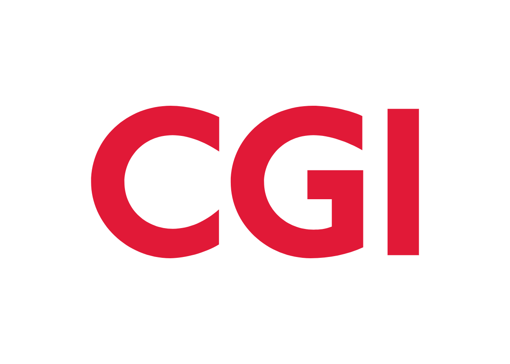

# Étude de cas — CGI à Québec

::: warning Attention
Cette entreprise sert d'exemple pour le cours. **Vous ne pouvez pas choisir CGI pour votre travail pratique.**
:::

Ce tableau se retrouve une seule fois dans votre travail, en haut de la partie B.

| Entreprise | Secteur d'activité | Localisation du siège social | Date de fondation |
| --- | --- | --- | --- |
| [CGI](https://www.cgi.com/fr) | Services dans les domaines financiers, secteur public et industriel | Montréal, Québec, Canada | 1976 |
>Tableau 1 - Exemple de tableau synthèse pour l'analyse d'une entreprise

## Analyse de l'entreprise CGI

<figure class="my-6 max-w-xs">
	
	<figcaption>
		Logo de CGI. Source : <a href="https://logotyp.us/logo/cgi/" target="_blank" rel="noopener">logotyp.us</a>
	</figcaption>
</figure>

### Brève description de l'entreprise

<figure class="md:float-right md:ml-6 mb-4 md:w-80">
	
	<figcaption>
		Bureaux de CGI. Source : <a href="https://maps.app.goo.gl/kfKZZZt3cN68Mv2Y6" target="_blank" rel="noopener">Google Maps</a>
	</figcaption>
</figure>

CGI est une **entreprise privée** spécialisée dans les services de conseil en technologie de l'information (TI) et en management. Elle accompagne ses clients dans leur transformation numérique et l'amélioration de leur rendement ([CGI, 2026](https://www.cgi.com/fr)).
On peut distinguer trois grands pilliers de valeurs chez CGI:
- L'esprit de propriété où les actionnaires sont des propriétaires;
- L'innovation créative;
- La génération de résultats tangibles ([CGI, 2026](https://www.cgi.com/fr)).

### Domaine informatique principal

De par son ampleur, on peut en déduire que CGI touche à la plupart des domaines en informatique. En se basant sur la page de carrières, on peut voir que les domaines actuellement en demande sont:
- le développement logiciel;
- L'infrastructure infonuagique;
- L'analyse de données et l'intelligence artificielle ([Carrières CGI, 2026](https://cgi.njoyn.com/corp/xweb/xweb.asp?CLID=21001&page=joblisting&lang=2)).

### Poste en informatique qu'on peut y retrouver

Un des postes actuellement recherchés à Québec est un Lead QA. Le Lead QA (Quality Assurance) est à la fois un expert technique et un leader d’équipe, capable de gérer des projets tout en soutenant la montée en compétences des ingénieurs QA ([Inforca, 2026](https://inforca.mc/carriere/fiches-metiers/test-informatique/lead-qa)).

Chez CGI, le Lead QA sera amené entre autres à concevoir, maintenir des tests automatisés et à faire évoluer les stratégies de tests. Comme c'est un poste de responsable, il devra non seulement posséder des qualités techniques mais aussi des compétences de leadership, car il sera amené à encadrer des membres juniors de l'équipe ([Carrières CGI, 2026](https://cgi.njoyn.com/corp/xweb/xweb.asp?CLID=21001&page=joblisting&lang=2)).

## Bibliographie

Voici un exemple de **bibliographie en style APA**

Dans votre travail pratique, la bibliographie se retrouve **une seule fois, à la fin du travail**, et elle regroupe l'ensemble des sources utilisées.

CGI. (2026). *CGI*. https://www.cgi.com/fr

CGI. (2026). *Carrières CGI*. https://cgi.njoyn.com/corp/xweb/xweb.asp?CLID=21001&page=joblisting&lang=2

Inforca. (2026). *Lead QA*. https://inforca.mc/carriere/fiches-metiers/test-informatique/lead-qa