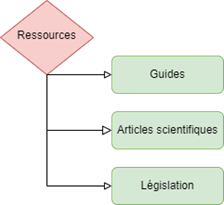

  

    <h1 class="m-0">TP1 — Collaboration et coédition</h1>
    
420-06A — Milieu de l’informatique

  

  

    
<strong>Équipe :</strong> 3 à 4 étudiants

    
<strong>Remise :</strong> dépôt sur Léa (voir consignes)

  

---

## Mise en situation

Vous faites partie d’une jeune équipe universitaire qui a mis en place un logiciel de détection de plagiat innovant destiné à améliorer l’intégrité académique dans les institutions d’enseignement supérieur. Récemment, vous avez décidé de lancer une nouvelle fonctionnalité qui détecte également **l’autoplagiat**.

Pour mettre en œuvre cette nouvelle fonctionnalité, vous devez tester votre système à grande échelle avec une grande variété de documents académiques. Votre première étape consiste à effectuer le travail préparatoire à votre projet.

---

## Objectifs du travail

1. Valider vos installations du premier cours  
2. Mettre en pratique la **gestion de fichiers informatiques**  
3. Démontrer vos compétences en **coédition** et **collaboration** avec M365  
4. Valider votre compréhension du **plagiat** et de l’**autoplagiat**

::: info
- Ce travail se réalise en **équipe de 3 à 4**. Choisissez un **responsable d’équipe**.
- [Formation des équipes GROUPE 1](https://livecegepfxgqc-my.sharepoint.com/:x:/g/personal/otremblay_cegepgarneau_ca/IQAvf_qftUIQS7c759lhnDgbATnT41clfv4RMZQBOutJGFw?e=1P4kXk)
- [Formation des équipes GROUPE 2](https://livecegepfxgqc-my.sharepoint.com/:x:/g/personal/otremblay_cegepgarneau_ca/IQAKDA7_-ptNRaliAc1eEfwhAZSEAPsPbhlJ4tLNj0EVPac?e=dnexwh)

**Les équipes peuvent être formées/complétées par le professeur.**
:::

---

## Consignes

## 1) Préparation (Word)

### À faire individuellement

1. Créez un document Word nommé **`Informations_sur_plagiat.docx`**.
2. Rendez-vous à la page Web **https://www.cegepgarneau.ca/cegep/plagiat** et **copiez/collez tout le texte des éléments interactifs**  de la page dans ce document.
   - Attention : incluez aussi le texte de chaque **élément interactif**.
3. Lisez le texte et :
   - surlignez les mots importants;
   - ajoutez des notes sous forme de **commentaires**.
4. Créez un **nouveau document Word** nommé **`Résumé_de_lecture.docx`**.
5. Rédigez une **liste à puces** des informations pertinentes retenues.
   - Vous êtes évalués sur la **pertinence** de votre résumé.

### En collaboration

6. Dans son OneDrive, le **responsable d’équipe** crée l’arborescence suivante :  
   **`420-06A – Milieu de l’informatique > Travaux > TP1`**
7. Pour chaque coéquipier, créez un dossier au nom du coéquipier selon le format :  
   **`NOM_Prenom`**
8. Dans le dossier de chaque coéquipier, placez :
   - `Informations_sur_plagiat.docx`
   - `Résumé_de_lecture.docx`
9. Faites un **retour d’équipe** pour comparer vos résumés.
10. Produisez un document **`Résumé_commun.docx`** (résumé épuré des échanges) et placez-le :
   - dans un dossier qui sera **toujours gardé en bas** du dossier **TP1**.

::: tip
Astuce : pour garder un dossier « en bas », utilisez le principe de numérotation des dossiers vu en cours **(01_Contenus, 02_Travaux, ..., 99_Archives)**.
:::

---

## 2) Développement

### Partie 1 — Dossiers collaboratifs dans OneDrive (structure seulement)

**Chaque membre doit télécharger les fichiers sources: <a href="./../public/tps/tp1-sources.zip" target="_blank" rel="noopener">Fichiers sources à télécharger (.zip)</a>

::: warning
Les fichiers fournis sont dans le désordre. C’est volontaire. C’est votre travail de les remettre en ordre en manipulant des accès différents. Voir Partie 2 du présent travail.
:::

Dans les fichiers sources fournis, chaque coéquipier possède un ensemble de fichiers à placer dans une arborescence que vous devez créer.

> ⚠️ **Pour l’instant, vous ne placez aucun fichier** : vous créez seulement l’arborescence de dossiers.

1. Créez un dossier **`Études de cas`** à la racine de **TP1**.
   - Il contiendra plusieurs études de cas (une par personne).
   - La structure d’une étude de cas est montrée dans l’image fournie.
   - Vous pouvez ajuster les noms, mais gardez **l’ordre** des éléments.
   - Prévoyez qu’il pourrait y avoir **plus de 100** études de cas.
2. Créez un dossier **`Ressources`** (un seul pour toute l’équipe) à la racine de **TP1**.
   - L’ordre des sous-dossiers n’est pas important.
3. Dans **Études de cas**, créez un **`Modèle de dossier`**.
   - Ce dossier doit se classer complètement **en haut**.
4. **Astuce** Faites une **carte heuristique** pour planifier votre classement.
   - Whiteboard M365 ou tableau en classe + photo ([Essayez cet outil pratique](https://www.mindmaps.app/)).

   
   

---

### Partie 2 — OneDrive (partage + dépôt des fichiers)

1. Le responsable partage le sous-dossier **`TP1`** à ses collègues **en lecture seule** (sans modification).
2. Le responsable crée la structure de la Partie 1 dans son OneDrive à l’intérieur de **TP1**.
3. Le responsable crée une étude de cas par coéquipier (en utilisant le modèle) :
   - ex. **`Étude de cas 2`**, **`Étude de cas 3`**, etc.
   - Puis il donne les droits **de modification** individuellement :
     - Étude de cas 2 → coéquipier 2
     - Étude de cas 3 → coéquipier 3
4. Chaque coéquipier télécharge le fichier `.zip` mentionné plus haut et place ses fichiers au bon endroit :
   - certains dans **Ressources**
   - d’autres dans **Études de cas**

Règles de classement :
- Pour les fichiers contenant des **dates**, assurez-vous qu’elles soient en **ordre chronologique** (renommage léger permis).
- Pour les fichiers avec un **ordre logique** (ex. `premier.docx`, `deuxième.docx`), assurez-vous que la séquence est respectée (renommage léger permis).

---

### Partie 3 — Coédition et révision dans Word

Les responsable doit télécharger le document Word suivant: <a href="./../public/tps/tp1-coédition.docx" target="_blank" rel="noopener">Document à télécharger (.docx)</a>

::: warning
N’acceptez pas les insertions dans l’onglet «Accepter» les marques de révision. Ceci me permettra de voir qui a fait l’insertion de chaque texte.
:::

1. Le responsable dépose une copie de ces consignes en format Word dans le dossier qui se classe automatiquement **en bas** du dossier TP1.
2. Il partage le document en **mode coédition** à ses collègues.  
   *(Le dossier TP1 est déjà partagé en lecture seule; les droits d’écriture doivent être au niveau du **document** seulement.)*
3. Chaque coéquipier ouvre le document en mode **Révision** et fait les tâches suivantes :
   1. À la première page, écrire son nom.
   2. Répondre au questionnaire plus bas (répartissez-vous les questions et révisez les réponses des autres).
   3. Ajouter un commentaire avec notification (ex. `@collègue1` et `@Olivier Tremblay`).
   4. Répondre à un commentaire.
   5. Modifier un mot ou une phrase d’un autre coéquipier.
   6. Supprimer un mot ou une phrase.
4. Finalisation :
   - Le responsable partage le **dossier racine TP1** avec droit d’écriture **au professeur uniquement** (les collègues restent en lecture seule).
   - Il insère le lien sur le texte prévu à cet effet (ne pas afficher l’URL complète).

---

## Modalités de remise

### Date et pondération
La date de remise est indiquée dans **Léa**.

### Fichier(s) et espace de dépôt
Le dossier racine **TP1** doit être **compressé** et déposé sur **Léa** par le responsable d’équipe uniquement.

---

## Liste de vérification

<ul class="checklist">
  <li><label><input type="checkbox">Il y a un dossier classé complètement en bas du dossier racine et il contient :</label>
    <ul class="checklist">
      <li><label><input type="checkbox">`Résumé_commun.docx`</label></li>
      <li><label><input type="checkbox">Le document Word de coédition (copie coéditée)</label></li>
    </ul>
  </li>
  <li><label><input type="checkbox">Il y a un dossier pour chacun des coéquipiers contenant :</label>
    <ul class="checklist">
      <li><label><input type="checkbox">`Informations_sur_plagiat.docx`</label></li>
      <li><label><input type="checkbox">`Résumé_de_lecture.docx`</label></li>
    </ul>
  </li>
  <li><label><input type="checkbox">Il y a un dossier `Ressources`</label></li>
  <li><label><input type="checkbox">Il y a un dossier `Études de cas`</label>
    <ul class="checklist">
      <li><label><input type="checkbox">Il contient un `Modèle de dossier` (en haut)</label></li>
      <li><label><input type="checkbox">Il contient une étude de cas par coéquipier</label></li>
    </ul>
  </li>
  <li><label><input type="checkbox">Les fichiers du `.zip` sont dézippés, classés et renommés correctement</label></li>
  <li><label><input type="checkbox">Le tableau d’identification d'équipe est complété en coédition</label></li>
  <li><label><input type="checkbox">Le dossier racine TP1 est compressé et déposé dans Léa</label></li>
</ul>

---
