# Travail pratique 2 — Excel  
**Cours :** 420-06A-FX — Milieu de l’informatique  
**Session :** Hiver 2026  

---

## Classeur de départ à télécharger

Vous devez d'abord télécharger <a href="./../tps/TP2_Budget.xlsx" target="_blank" rel="noopener">le classeur suivant</a> sur votre poste.

---

## Vidéo explicative de l'énoncé (à regarder avant de commencer)

<iframe width="560" height="315" src="https://www.youtube.com/embed/Apr6MkV2Hgo?si=S2YUc3v3GF4EVVyf" title="YouTube video player" frameborder="0" allow="accelerometer; autoplay; clipboard-write; encrypted-media; gyroscope; picture-in-picture; web-share" referrerpolicy="strict-origin-when-cross-origin" allowfullscreen></iframe>

---

## Objectif

Créer un **outil de budget mensuel** dans Excel qui permet de :

- saisir des **revenus** et des **dépenses fixes**
- calculer un **budget mensuel** et un **budget journalier**
- saisir une **liste de dépenses (plusieurs par jour)** avec **catégorie**
- produire des **statistiques**
- produire 2 **tableaux croisés dynamiques (TCD)** et 1 **graphique**

---

## À remettre

Un **classeur Excel (.xlsx)** contenant **4 feuilles** :

1. **Gabarit** (formules seulement, aucune donnée fictive)
2. **Février 2026** (copie du gabarit + données fictives)
3. **Dépenses par jour** (tableau croisé dynamique pour février)
4. **Dépenses par catégorie** (tableau croisé dynamique et graphique circulaire pour février)

> Nommez vos feuilles **exactement** comme demandé.

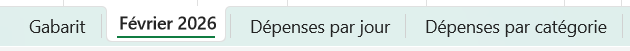

---

## Consignes générales

- Les cellules jaunes du gabarit doivent contenir des **formules** (pas de calculs “à la main”).
- Toutes les cellules d’argent doivent être formatées en **$** monétaire.
- Le classeur ne doit contenir **aucune erreur Excel** (`#DIV/0!`, `#N/A`, etc.).
- Les données de **février 2026** sont **fictives** (démonstration).

---

## Feuille 1 — Gabarit (formules seulement)

### 1) Revenus et dépenses fixes
Dans la section **Revenus** et **Dépenses fixes** :

- calculer le **total des revenus**
- calculer le **total des dépenses fixes**
- si aucun montant n’est saisi, afficher **0,00 $** dans les totaux
- les totaux doivent être **en gras**

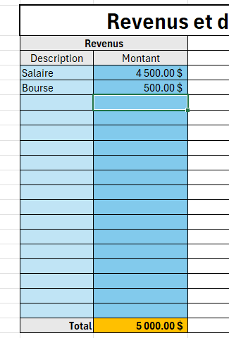
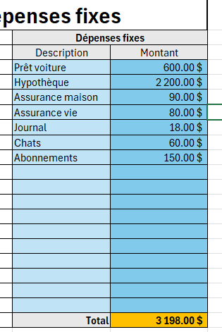

---

### 2) Dates du mois
- la cellule **B3** contient le mois (ex. `févr-26`), prendre le bon format (personnalisé)
- les dates **Du** et **Au** se calculent automatiquement

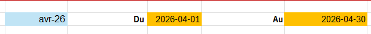

---

### 3) Budget mensuel et budget journalier
- **Budget mensuel** = Revenus totaux − Dépenses fixes totales
- **Budget journalier** = Budget mensuel ÷ nombre de jours du mois

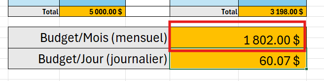

>Budget mensuel

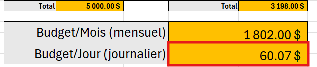

>Budget journalier

---

### 4) Catégories + budgets alloués
Complétez table **Catégories des dépenses** avec :

- **Budget alloué par mois** (montant monétaire)
- Décidez des montants par vous-mêmes selon ce qui semble réalisable pour vous

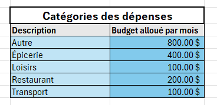

> La colonne **Catégorie** de la liste de dépenses doit être une **liste déroulante** basée sur la table de catégories.

### 5) Liste des dépenses du mois
La table contient les colonnes suivantes (ne pas changer la structure)

- **Date** (format date)
- **Description**
- **Catégorie** (liste déroulante à partir des catégories des dépenses)
- **Dépense** (format monétaire)

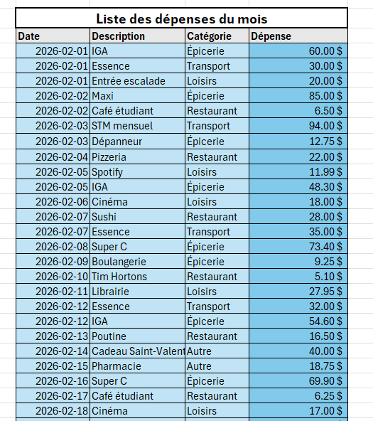

---

### 6) Statistiques de dépenses du mois
Complétez à l'aide de formules une zone de statistiques :

- **Moyenne des dépenses**
- **Plus grosse dépense**
- **Plus petite dépense**
- **Total des dépenses**

> Ces statistiques sont calculées à partir du tableau de gauche **Liste des dépenses du mois**

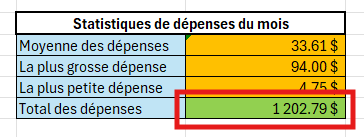

#### Mise en forme conditionnelle (statistiques)
Appliquer une mise en forme conditionnelle sur **Total des dépenses** :

- **Rouge** si le total des dépenses est **strictement supérieur** au **budget mensuel**
- **Vert** si le total des dépenses est **inférieur ou égal** au **budget mensuel**

---

## Feuille 2 — Février 2026 (copie du gabarit)

1. Faites une **copie** de la feuille **Gabarit**
2. Renommez-la **Février 2026**
3. Ajoutez des **données fictives** :
   - revenus
   - dépenses fixes
   - dépenses du mois (plusieurs par jour)
   - utilisez plusieurs catégories

> Vous devez avoir assez de données pour que les TCD et le graphique soient significatifs.
>Assurez-vous de vider les données de le feuille **gabarit**, **conserver les formules**.

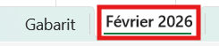

---

## Feuille 3 — TCD — Dépenses par jour — Février 2026

À partir des données de la liste de dépenses du mois:

1. Insérez un tableau croisé dynamique dans une nouvelle feuille et nommez-la :  
   **Dépenses par jour**
2. Créez un **tableau croisé dynamique** qui affiche :
   - **lignes :** Date
   - **valeurs :** Somme de Dépense

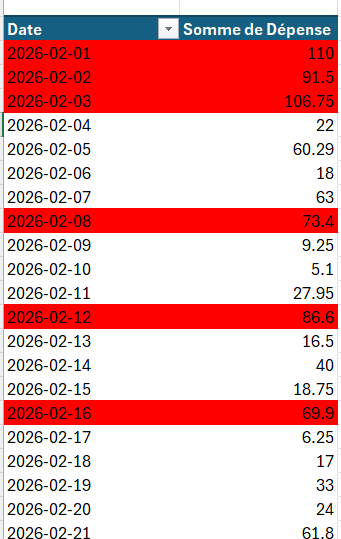

### Mise en forme conditionnelle (ligne rouge)
Appliquez une mise en forme conditionnelle sur le TCD :

- la **ligne complète** d’une date devient **rouge** si la **Somme de Dépense** de cette date **dépasse le budget journalier indiqué dans le mois de février (autre feuille)**
- sinon, aucun surlignage rouge

---

## Feuille 4 — TCD — Dépenses par catégorie — Février 2026

À partir des données de la liste de dépenses du mois:

1. Insérez un tableau croisé dynamique dans une nouvelle feuille et nommez-la :  
   **Dépenses par catégorie**
2. Créez un **tableau croisé dynamique** qui affiche :
   - **lignes :** Catégorie
   - **valeurs :** Somme de Dépense

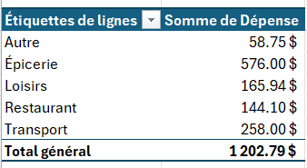

### Graphique (tarte)
Dans la même feuille :

- insérez un **graphique en pointes de tarte** basé sur le TCD
- titre : **Dépenses par catégorie pour février**
- les **valeurs** (montants) doivent être **affichées** sur le graphique
- Vous **pouvez** personnaliser le graphique si cela vous tente

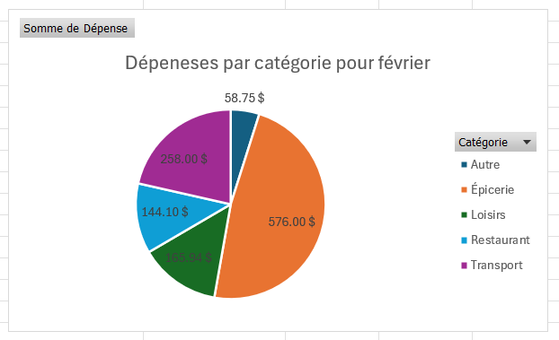

### Mise en page pour impression (portrait)
- Positionnez le **TCD** et le **graphique** pour qu’ils entrent sur **une seule page**
- Réglez l’impression en **mode portrait**

---

## Évaluation (rappel)

- Le classeur doit contenir **4 feuilles** exactement comme demandé.
- Les formules doivent fonctionner et être robustes.
- Le fichier ne doit contenir aucune erreur Excel.

---

## Modalités de remise

- **Plateforme :** LÉA  
- **Format :** fichier Excel (.xlsx)  
- **Date limite :** voir LÉA  
- **Pondération :** 20 %
