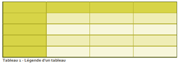
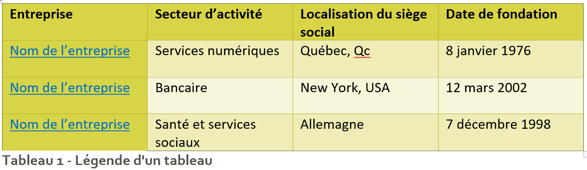

# Travail pratique 3 — Rapport Word

## Objectif

Ce travail comporte deux parties :

- **Partie A :** créer un **modèle de rapport Word professionnel** réutilisable dans d’autres cours.
- **Partie B :** utiliser ce modèle pour rédiger un **rapport de recherche sur des entreprises du domaine informatique**.

Ce travail a deux objectifs pédagogiques :

1. apprendre à **produire un document professionnel avec Microsoft Word** ;
2. mieux comprendre **le milieu de travail en informatique**, notamment les entreprises, les métiers et les compétences recherchées.

Les recherches réalisées dans ce travail vous aideront également à **préparer les visites d’entreprises prévues durant la session**.

---

## TLDR

### Partie A

Créer un **modèle Word (.dotx)** respectant les normes de présentation demandées.

### Partie B

Utiliser ce modèle pour rédiger un **rapport sur trois entreprises en informatique** :

- entreprise visitée #1
- entreprise visitée #2
- une entreprise de votre choix

---

## Partie A — Création du modèle Word

**Modèle à suivre : <a href="./../tps/Modèle (Partie A).pdf" target="_blank" rel="noopener">Modèle (Partie A).pdf</a>**

### Création du document

Créer un document Word qui servira de **modèle de rapport**.

Ce document doit contenir **du contenu générique**, car il s’agit d’un modèle et non d’un vrai rapport.

Vous pouvez utiliser du **texte de substitution (Lorem Ipsum)** pour remplir certaines sections : [loremipsum.io](https://loremipsum.io/).

---

### Structure du document

Votre modèle doit contenir les pages suivantes.

#### 1) Page de présentation

Contenu requis :

- logo du **Cégep Garneau**
- texte : **Département d’informatique**
- travail no. X
- titre du travail
- présenté par : *Votre nom*
- cours : **420-06A-FX — Milieu de l’informatique**
- nom du professeur

La page doit contenir **une bordure de page**.

---

#### 2) Page blanche

La page suivante doit être **complètement vide**.

⚠️ Ne pas simplement ajouter des lignes vides.

---

#### 3) Table des matières

La table des matières doit :

- être **automatique**
- pouvoir être **mise à jour**
- être seule sur sa page
- utiliser une **numérotation romaine**
- être centrée au bas de la page

Les marges de cette page doivent être **larges**.

---

#### 4) Pages de contenu

Le modèle doit contenir :

- **3 titres de niveau 1**
- **3 titres de niveau 2** (sous-titre)
- **3 titres de niveau 3** (sous-sous-titre)

Les titres doivent être accompagné de contenus textes et images (voir les éléments obligatoire ci-bas).

**Référez-vous au <a href="./../tps/Modèle (Partie A).pdf" target="_blank" rel="noopener">Modèle (Partie A).pdf</a>.**

#### 5) Bibliographie

Ajouter une page **Bibliographie** contenant une **bibliographie fictive**.

Utiliser le **style APA** pour la citation et la bibliographie.

Elle sera remplacée par de vraies sources dans la partie B.

---

### Éléments obligatoires

Votre modèle doit également contenir :

#### Citation

Insérer **au moins une citation** dans le document (elle peut être fictive).

L'exemple de citation se trouve à la **page 6** du <a href="./../tps/Modèle (Partie A).pdf" target="_blank" rel="noopener">Modèle (Partie A).pdf</a>, avec l'exemple **Les Technologies, 2020**.

Une citation sert à intégrer dans le texte une idée, une information ou un extrait provenant d'une source (même lorsque reformulée).

Une citation apparaît normalement entre parenthèses suite au texte et doit correspondre à une source qui pourra ensuite être indiquée dans la bibliographie.

---

#### Note explicative en bas de page

Insérer **au moins une note explicative en bas de page**.

L'exemple de note de bas de page se trouve à la **page 5** du <a href="./../tps/Modèle (Partie A).pdf" target="_blank" rel="noopener">Modèle (Partie A).pdf</a>.

La note de bas de page sert à ajouter une explication, une précision ou un commentaire complémentaire sans alourdir le texte principal.

Elle ne remplace pas une citation ni une entrée de bibliographie.

---

#### Tableau

Créer un tableau **identique à celui à la page 6 du <a href="./../tps/Modèle (Partie A).pdf" target="_blank" rel="noopener">Modèle (Partie A).pdf</a>** :

Référence visuelle du tableau : 

- avec un **style différent du style par défaut**
- avec une **légende significative**

Ce tableau pourra être utilisé dans la partie B pour présenter les entreprises.

---

#### Images

Insérer **au moins deux images de votre choix** avec :

- une **légende significative qui est un lien cliquable vers la source de l'image**

Le positionnement des images doit être **identique à celui du <a href="./../tps/Modèle (Partie A).pdf" target="_blank" rel="noopener">Modèle (Partie A).pdf</a>**.

---

### En-têtes et pieds de page

La page de présentation **ne doit pas contenir d’en-tête ni de pied de page**.

Pages paires :

- en-tête à droite → titre du travail
- pied de page à droite → numéro de page

Pages impaires :

- en-tête à gauche → votre nom
- pied de page à gauche → numéro de page

Encore une fois, **référez-vous au <a href="./../tps/Modèle (Partie A).pdf" target="_blank" rel="noopener">Modèle (Partie A).pdf</a> pour obtenir une image claire de ce qui est requis.**

---

### Fichiers à produire

Partie A :

- `TP3-A_Modele_Prenom_Nom.dotx` **(DOTX, PAS DOCX car c'est un modèle/gabarit)**
- `TP3-A_Modele_Prenom_Nom.pdf`

Les fichiers doivent être nommés **exactement** comme indiqué ci-dessus. Remplacez `Prenom` et `Nom` par votre prénom et votre nom.

Le document Word de la partie A doit être **exporté en PDF** avant la remise.

---

## Partie B — Rapport sur des entreprises

Dans cette partie, vous devez **utiliser le modèle créé dans la partie A** (créez une copie du modèle et renommez-la `TP3-B_Rapport_Prenom_Nom.docx`).

Un exemple complet d'analyse d'une entreprise se trouve ici : [Étude de cas — CGI à Québec](../modules/04-analyse-info/04-etude-cgi).

Le rapport doit analyser **trois entreprises employant des informaticiens**. Vous devez **obligatoirement** analyser les entreprises que nous avons prévues visiter pour votre groupe.

Vous devez inclure :

- **Entreprise visitée #1**
- **Entreprise visitée #2**
- **Une entreprise de votre choix située dans la région de Québec et qui oeuvre dans un secteur d'activité différent de celui des deux entreprises précédentes**

Pour connaître les entreprises qui seront visitées, consultez le calendrier de votre groupe : [groupe 1 (jeudi)](../plan-cours/calendrier-gr1.md) ou [groupe 2 (mardi)](../plan-cours/calendrier-gr2.md).

---

### Introduction (max 1 demi page)

Présenter :

- le but du travail
- le contexte
- les sections du rapport

Structure imposée pour votre introduction :

- sujet amené (introduire le sujet sans le nommer)
- sujet posé (présenter clairement le sujet)
- sujet divisé (présenter la structure du développement c'est-à-dire les entreprises qui seront à l'étude plus bas dans votre travail)

Guide de référence : [Structure du texte argumentatif (Alloprof)](https://www.alloprof.qc.ca/fr/eleves/bv/francais/l-introduction-du-texte-argumentatif-f1450#introduction).

---

### Entreprises sélectionnées (max 1 demi page)

Compléter le tableau créé dans votre modèle (ajouter des colonnes au besoin).

Référence visuelle du tableau à compléter : 

Inclure :

- nom de l’entreprise (**lien cliquable** vers le site Web)
- secteur d'activité de l'entreprise
- localisation du siège social
- date de fondation

Le tableau doit avoir **une légende significative**.

---

### Présentation des entreprises (environ 1 - 2 pages par entreprise)

Créer une **section** pour **chaque entreprise**.

Pour chaque entreprise, présentez de façon concise en **sous-sections** :

- une brève description de l’entreprise incluant sa mission, ses valeurs ainsi que le **type d'entreprise (privée, publique, OBNL)**
- son **domaine informatique principal** ou celui actuellement en demande
- **un poste en informatique différent pour chaque entreprise** que l’on peut y retrouver (section carrières)
    - quelques **tâches, responsabilités et compétences** associées au poste **dans cette entreprise**; il ne s'agit pas d'une description générale du métier

Le poste choisi doit être différent d'une entreprise à l'autre. Vous ne pouvez pas réutiliser le même poste pour plusieurs entreprises.

Ajouter aussi pour chaque entreprise analysée :

- le **logo**
- une **photo du bâtiment ou des bureaux**

Chaque image doit avoir **une légende**.

Appuyez votre texte avec **des sources fiables et variées à l'aide de citations**. Si la section carrières de l'entreprise est vide ou peu détaillée, vous pouvez aussi déduire l'information à partir d'offres d'emploi pour des postes similaires dans des entreprises comparables, trouvées sur Indeed, LinkedIn, Glassdoor, etc.

::: warning Attention aux sources
Il est **obligatoire** de citer vos sources en utilisant des **citations** dans le texte.

**Pas de sources = pas de points** pour cette section du travail.
:::
---

### Les entreprises en informatique à Québec (environ 1 demi page)

Comparer les entreprises étudiées.

Identifier :

- leurs similarités
- leurs différences

---

### Conclusion (environ 1 demi page)

La conclusion doit :

- résumer les idées principales
- présenter une réflexion personnelle sur le domaine de l’informatique

Questions pour vous guider :

- Qu’avez-vous retenu de votre analyse des entreprises choisies ?
- Quel type d’entreprise, de secteur d’activité ou de poste vous semble le plus intéressant, et pourquoi ?
- En quoi cette recherche vous aide-t-elle à mieux comprendre le milieu de l’informatique au Québec ?

---

### Bibliographie (sur une page à part)

La bibliographie doit contenir **toutes les sources utilisées**.

Utiliser le **style APA** de façon cohérente dans tout le document.

Tutoriel Word (bibliographie, citations et références) : [Microsoft Support](https://support.microsoft.com/fr-fr/office/cr%C3%A9er-une-bibliographie-des-citations-et-des-r%C3%A9f%C3%A9rences-17686589-4824-4940-9c69-342c289fa2a5?ui=fr-fr&rs=fr-fr&ad=fr).

---

### Citations

Créer **au moins deux citations** par entreprise analysée dans le document.

Chaque citation dans le texte doit être faite en **style APA** et correspondre à une source présentée dans la bibliographie. Les sources doivent être variées (pas uniquement le site Web de l'entreprise analysée). Les [sources suivantes](../modules/04-analyse-info/01-recherche#quelles-sources-utiliser) vous seront utiles.

Tutoriel Word (bibliographie, citations et références) : [Microsoft Support](https://support.microsoft.com/fr-fr/office/cr%C3%A9er-une-bibliographie-des-citations-et-des-r%C3%A9f%C3%A9rences-17686589-4824-4940-9c69-342c289fa2a5?ui=fr-fr&rs=fr-fr&ad=fr).

---

### Fichiers à produire

Partie B :

- `TP3-B_Rapport_Prenom_Nom.docx`
- `TP3-B_Rapport_Prenom_Nom.pdf`

Les fichiers doivent être nommés **exactement** comme indiqué ci-dessus. Remplacez `Prenom` et `Nom` par votre prénom et votre nom.

Le document Word de la partie B doit être **exporté en PDF** avant la remise.

---

## Révision linguistique

Avant la remise :

- utiliser **Antidote** : [connexion Druide](https://services.druide.com/connexion/externe?app=aw&langueDefaut=fr)
- corriger l’orthographe
- corriger la syntaxe

⚠️ Des pénalités peuvent être appliquées pour les fautes de français.

---

## Remise

Fichiers à remettre :

Les fichiers doivent être nommés **exactement** comme suit. Remplacez `Prenom` et `Nom` par votre prénom et votre nom.

**Partie A**

- `TP3-A_Modele_Prenom_Nom.dotx`
- `TP3-A_Modele_Prenom_Nom.pdf`

**Partie B**

- `TP3-B_Rapport_Prenom_Nom.docx`
- `TP3-B_Rapport_Prenom_Nom.pdf`

Tous les fichiers doivent être remis dans :

**un fichier ZIP sur Léa**

---

## Pondération

Valeur du travail : **20 %**

Date limite : **voir Léa**